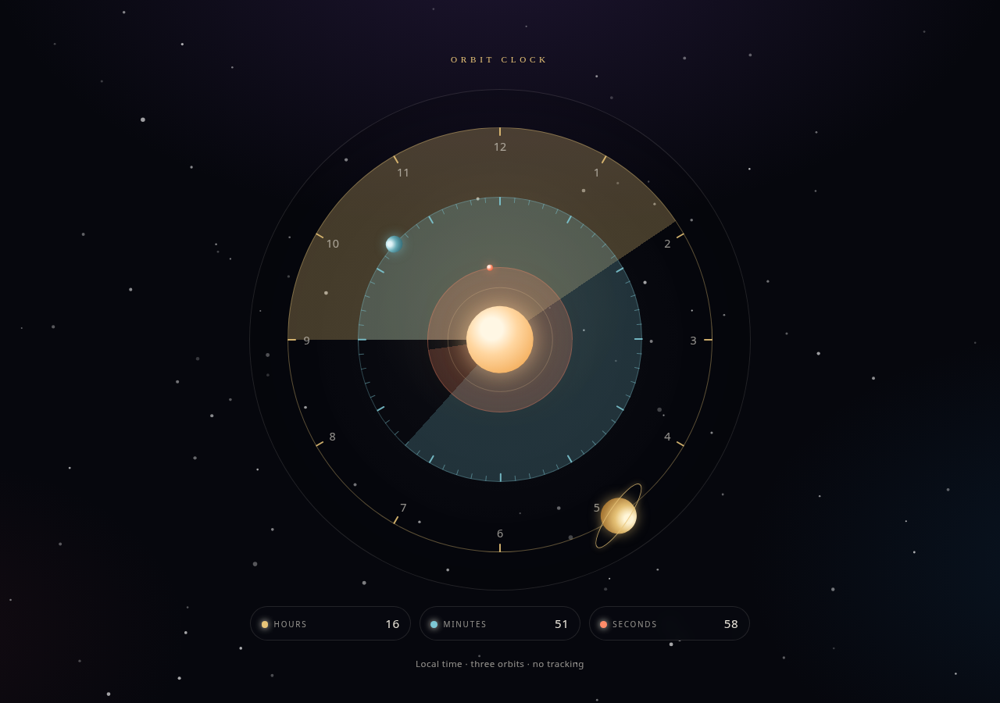

# Orbit Clock

A zero-dependency **orbital analog clock** for the browser. Hours, minutes, and seconds travel as planets on three concentric rings — a small, self-contained piece you can open locally or publish on GitHub Pages.

No build step. No CDN. No tracking. Works offline.

<p align="center">
  
</p>

## Orbits

| Orbit | Body | Mapping |
| --- | --- | --- |
| Outer | Gold ringed planet | **Hours** on a 12-hour analog circle |
| Middle | Teal ice planet | **Minutes** (60-tick ring) |
| Inner | Ember spark | **Seconds** (smooth, including milliseconds) |

12 sits at the top. Motion is clockwise, like a conventional analog clock. Each ring fills as a faint sweep so the current position is readable at a glance. A compact Hours / Minutes / Seconds readout under the face mirrors the live time.

## Open it

Clone or download this repo, then open the file in a browser:

```bash
open index.html
```

On Linux:

```bash
xdg-open index.html
```

Or double-click `index.html` in your file manager. The clock is two static files (`index.html` + `orbit-time.js`) and runs from `file://` with no server.

Optional local server (not required):

```bash
python3 -m http.server 8080
```

Then visit [http://localhost:8080](http://localhost:8080).

## GitHub Pages

This is a static site at the repo root. In the GitHub repo: **Settings → Pages → Deploy from a branch**, choose `main` (or this feature branch) and `/ (root)`. Pages will serve `index.html` at `https://<user>.github.io/orbit-clock/`.

## Screenshot / demo

Open `index.html`, wait a second so the second planet is moving, then capture the window. `preview.png` is a still of the live clock.

## Tests

A tiny Node smoke check (no install, no extra packages):

```bash
npm test
```

or:

```bash
node --test test/smoke.test.mjs
```

It asserts the analog angle mapping (12/3/6/9, minute and second ticks, hour contribution from minutes) and that `index.html` contains the three orbits without CDN URLs.

## License

MIT © 78tacos. See [LICENSE](LICENSE).
